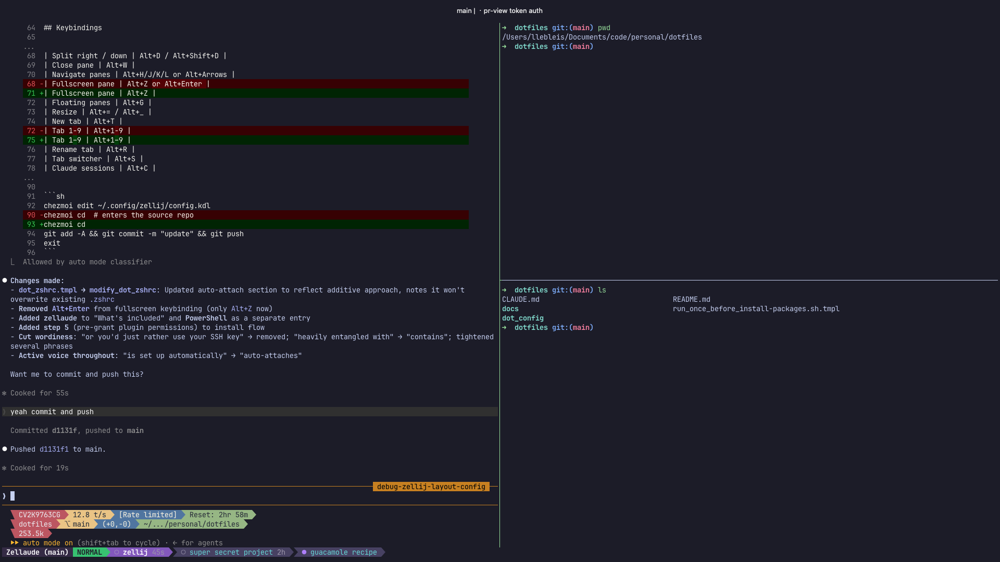

# dotfiles

Cross-platform terminal setup for [Zellij](https://zellij.dev/) + [Ghostty](https://ghostty.org/) + Claude Code, managed with [chezmoi](https://www.chezmoi.io/).



**One command** to get a consistent terminal on macOS, Linux, or Windows:
- Zellij multiplexer with Alt-based keybindings that work everywhere
- Ghostty / Windows Terminal auto-launches into a Zellij session
- Claude Code status bar ([zellaude](https://github.com/ishefi/zellaude)) showing tokens, model, and session state
- Plugins auto-downloaded and permissions pre-granted — no setup prompts
- Additive `.zshrc` — won't overwrite your existing shell config

## What's included

| Component | Description |
|-----------|-------------|
| **Zellij** | Multiplexer config, keybindings, and plugins |
| **Ghostty** | Terminal emulator config (macOS-templated, works on Linux) |
| **zellaude** | [Status bar plugin](https://github.com/ishefi/zellaude) for Claude Code session state |
| **ccstatusline** | [Token/model status bar](https://www.npmjs.com/package/ccstatusline) for Claude Code |
| **Plugins** | room, autolock, zj-quit, zellij-forgot — auto-downloaded via `.chezmoiexternal.toml` |
| **zsh** | Additive `.zshrc` management (bun PATH + Ghostty → Zellij auto-attach) |
| **PowerShell** | Windows Terminal → Zellij auto-attach profile |

## Install on a new machine

```sh
sh -c "$(curl -fsLS get.chezmoi.io)" -- init --apply Leolebleis
```

This will:
1. Install chezmoi
2. Clone this repo
3. Install zellij + ghostty (macOS via brew; Linux prints install links)
4. Download Zellij plugins
5. Pre-grant Zellij plugin permissions (no confusing prompts on first launch)
6. Deploy all configs

### Clone over SSH instead of HTTPS

If HTTPS auth fails, pass `--ssh`:

```sh
sh -c "$(curl -fsLS get.chezmoi.io)" -- init --apply --ssh Leolebleis
```

Requires an SSH key registered with GitHub — verify with `ssh -T git@github.com`.

## Auto-attach to Zellij

Opening Ghostty (macOS/Linux) or Windows Terminal (Windows) auto-attaches to a named `main` Zellij session:

- **zsh** (macOS/Linux): `modify_dot_zshrc` adds a guarded `exec zellij attach -c main` block. Guards on `$TERM_PROGRAM = ghostty` and `$ZELLIJ` not set. Won't overwrite your existing `.zshrc`.
- **pwsh** (Windows): `Microsoft.PowerShell_profile.ps1` guards on `$env:WT_SESSION` and `$env:ZELLIJ` not set.

Both `exec` into Zellij so the terminal closes on detach.

## ccstatusline

The config lives at `dot_config/ccstatusline/settings.json` and deploys to `~/.config/ccstatusline/settings.json`. Requires `bun` (installed by the setup script on macOS).

To wire it into Claude Code, add to `~/.claude/settings.json` (once per machine):

```json
"statusLine": {
  "type": "command",
  "command": "bunx -y ccstatusline@latest",
  "padding": 0
}
```

Not chezmoi-managed because `~/.claude/settings.json` contains per-machine plugin and hook state.

## Keybindings

| Action | Shortcut |
|--------|----------|
| Split right / down | Alt+D / Alt+Shift+D |
| Close pane | Alt+W |
| Navigate panes | Alt+H/J/K/L or Alt+Arrows |
| Fullscreen pane | Alt+Z |
| Floating panes | Alt+G |
| Resize | Alt+= / Alt+_ |
| New tab | Alt+T |
| Tab 1–9 | Alt+1–9 |
| Rename tab | Alt+R |
| Tab switcher | Alt+S |
| Claude sessions | Alt+C |
| Cheatsheet | Alt+E |
| Quit | Ctrl+Q |
| Lock/unlock | Ctrl+G |

## Update configs

```sh
chezmoi update -v
```

## Edit locally then push

```sh
chezmoi edit ~/.config/zellij/config.kdl
chezmoi cd
git add -A && git commit -m "update" && git push
exit
```
